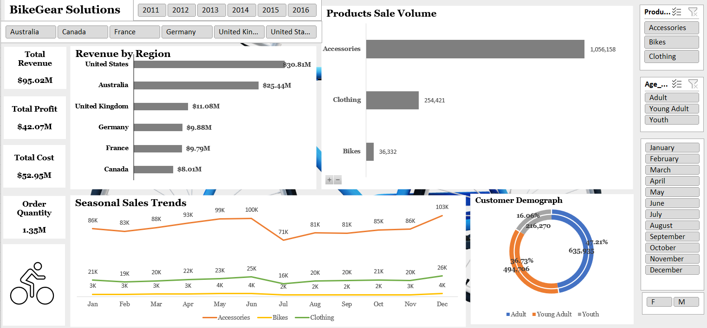

# 📊 BikeGear Solutions – Sales Optimization Case Study

## 🧾 Project Overview

This case study presents a business analysis project for **BikeGear Solutions**, a multinational cycling accessories retailer operating across the **U.S., Canada, UK, and Australia**. The company faced challenges understanding **regional sales trends, customer demographics, product performance**, and **seasonal buying patterns**.

As a **Business Analyst**, I used **Microsoft Excel** to perform an end-to-end data analysis of historical sales data to uncover insights and develop a strategy that improves marketing focus, product planning, and inventory management.

---

## 📷 Dashboard Preview

## 🛠 Tools & Technologies

- **Microsoft Excel** (Pivot Tables, Charts, Slicers, SUMIFS, IF, VLOOKUP)
- Descriptive Analysis & Segmentation
- KPI Calculation & Dashboard Design
- Data Cleaning and Structuring

---

## 📊 Dashboard File

Download the interactive Excel dashboard here:

📎 [BikeGearSalesDashboard.xlsx](./BikeGearSalesDashboard.xlsx)

---

## 🔧 Analysis Workflow

### 1. Data Cleaning
- Removed blanks and duplicates in customer, region, and product fields.
- Standardised text using `TRIM()`, `PROPER()`, and manual cleanup.
- Formatted date fields to extract `Day`, `Month`, `Year`.
- Ensured numerical consistency for `Order Quantity`, `Revenue`, `Profit`.

### 2. Data Modelling
- Created **calculated fields** for Revenue, Cost, and Profit.
- Segmented Age Groups:  
  - `< 25`: Youth  
  - `25–35`: Young Adult  
  - `> 35`: Adult
- Created time-based groupings for seasonal analysis.
- Structured clean data tables for use in pivot reporting.

### 3. Data Visualization
- Built an **interactive Excel dashboard**:
  - Revenue and Profit by Region
  - Customer Orders by Age Group and Gender
  - Sales Trends by Month and Year
  - Product Category Breakdown
- Used slicers and timelines for dynamic filtering

---

## 📈 Business Questions Answered

- Which **countries and states** generate the most revenue?
- Which **age groups and genders** buy the most?
- What are the best-performing **product categories**?
- How does **seasonality** impact sales volume and profit?

---

## 📌 Key Metrics (KPIs)

- Total Revenue
- Total Profit
- Total Order Quantity
- Units Sold by Category
- Revenue by Country & Age Group
- Seasonal Sales Volume

---

## 💡 Insights & Recommendations from Analysis

### 📍 Insights

#### 1. Top Markets by Revenue
- 🇺🇸 U.S.: **$30.81M**, 🇦🇺 Australia: **$25.44M**
- 🇬🇧 U.K.: **$11.08M**, 🇨🇦 Canada: **$8.01M**
> **Recommendation:** Prioritize U.S. and Australia for future marketing efforts. Reassess Canada's local strategy.

#### 2. Demographic Strength
- **Adults (35+)**: 47.2% of orders  
- **Young Adults (24–35)**: 36.7%  
- **Youth (<24)**: 16.1%
> **Recommendation:** Launch targeted campaigns for young adults. Build bundles around adult lifestyle products.

#### 3. Product Category Performance
- **Accessories**: 79% of volume  
- **Clothing**: 254K units  
- **Bikes**: Only 36K units
> **Recommendation:** Focus promotions on accessories. Consider bundling high-margin items.

#### 4. Seasonality Trends
- **Peak Month**: December (133K units)  
- **Lowest Month**: July (90K units)
> **Recommendation:** Plan stock ahead of Q4. Use flash sales and events during mid-year lulls.

---

### ✅ Strategic Recommendations

1. **Prioritize U.S. and Australia**
   - Invest in campaigns across top markets contributing over 60% of revenue.
   - Revisit Canada’s performance with localized outreach.

2. **Target Young Adults (24–35)**
   - Use digital-first campaigns, loyalty apps, and influencer outreach for tech-savvy young customers.

3. **Double Down on Accessories**
   - Bundle accessories with bikes or clothing.
   - Promote accessories during slow sales months.

4. **Plan Ahead for Seasonal Peaks**
   - Prepare inventory and promotions by Q3 for Black Friday and holiday season.
   - Stimulate summer sales with community rides, flash deals, or cycling events.

---

